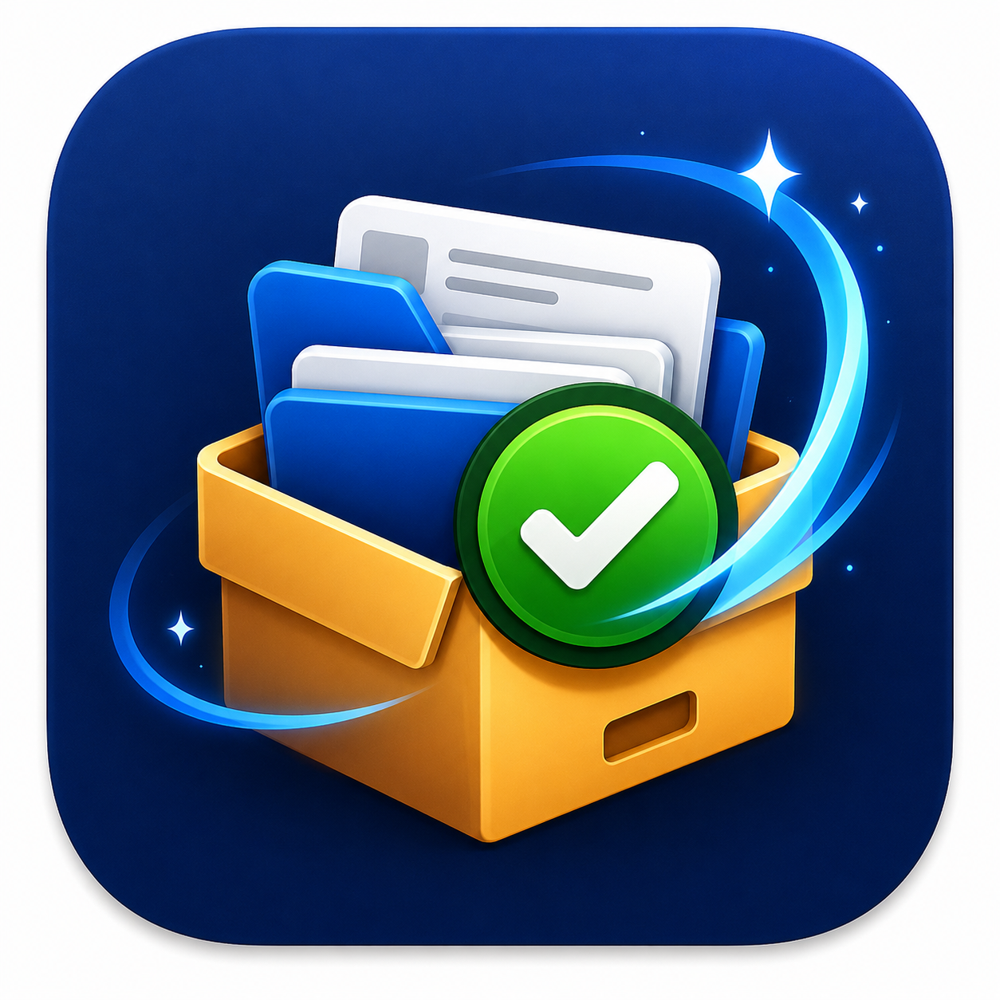
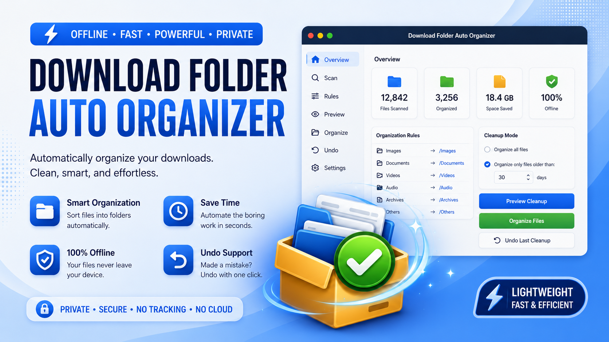

<h1 align="center">Download Folder Auto Organizer</h1>

  

  

  A clean offline macOS utility for organizing messy Downloads folders safely.

  <a href="https://gallonlabs.gumroad.com/l/download-folder-auto-organizer"><strong>Buy on Gumroad</strong></a>
  ·
  <a href="https://automatorlabs.itch.io/download-folder-auto-organizer"><strong>Download on itch.io</strong></a>

---

<h2>What It Does</h2>

Download Folder Auto Organizer turns a cluttered Downloads folder into clear, predictable subfolders.
It previews every planned move before anything changes, then organizes files only after you click <strong>Organize Files</strong>.

Files are moved, not deleted.

---

<h2>Features</h2>

<ul>
  <li>Choose any folder, with <code>~/Downloads</code> as the default</li>
  <li>Preview suggested file moves before organizing</li>
  <li>Organize all files or only older files</li>
  <li>Sort files into Images, PDFs, Videos, Audio, Documents, Spreadsheets, Archives, Installers, Code, Old Files, and Other</li>
  <li>Detect screenshots using common filename patterns</li>
  <li>Safe file handling with no overwrites</li>
  <li>Undo the latest cleanup session</li>
  <li>100% offline — no uploads, no cloud, no tracking</li>
  <li>Dark and Light Mode included</li>
</ul>

---

<h2>Screenshots</h2>

<h3>Dark Mode</h3>

  

<h3>Light Mode</h3>

  

<h3>Preview Cleanup</h3>

  

<h3>Previewing message for creating the Organized Folders</h3>

  

---

<h2>How It Works</h2>

<ol>
  <li>Choose your Downloads folder</li>
  <li>Click <strong>Preview Cleanup</strong></li>
  <li>Review suggested file moves</li>
  <li>Click <strong>Organize Files</strong></li>
</ol>

Nothing is deleted. You can undo the latest cleanup session anytime.

---

<h2>Safety Notes</h2>

<ul>
  <li>The app does not move anything on launch</li>
  <li>The app only organizes files after you confirm</li>
  <li>The app does not delete files</li>
  <li>The app does not overwrite existing files</li>
  <li>Existing destination files are protected with safe names like <code>file (1).pdf</code></li>
  <li>The app runs locally on your Mac</li>
</ul>

---

<h2>Download</h2>

Get the app here:

<ul>
  <li><a href="https://gallonlabs.gumroad.com/l/download-folder-auto-organizer">Gumroad</a></li>
  <li><a href="https://automatorlabs.itch.io/download-folder-auto-organizer">itch.io</a></li>
</ul>

---

<h2>Privacy</h2>

Download Folder Auto Organizer is fully offline.
Your files never leave your device.

No uploads. No tracking. No cloud dependency.

